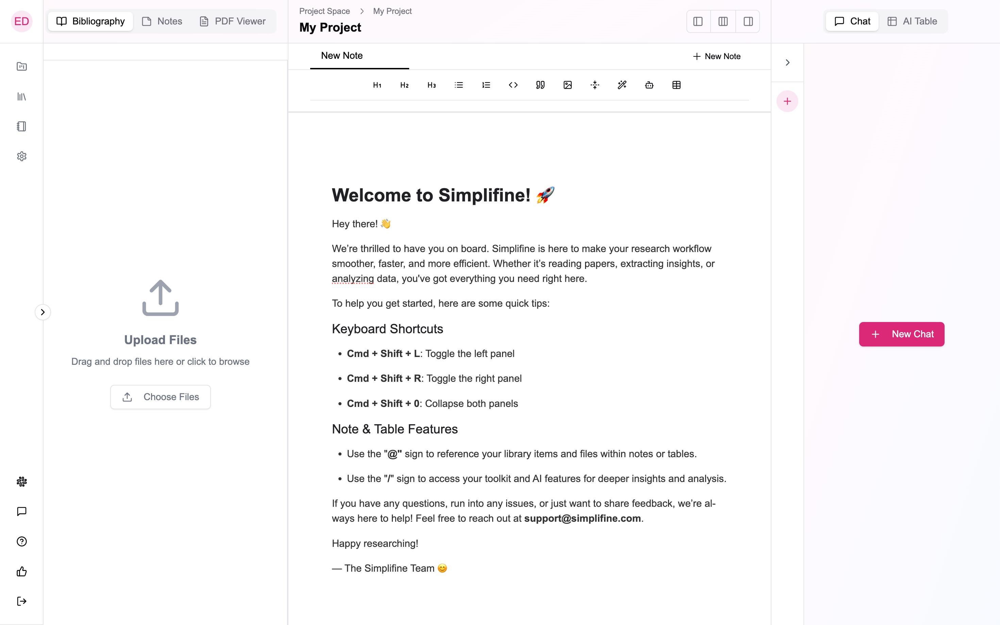
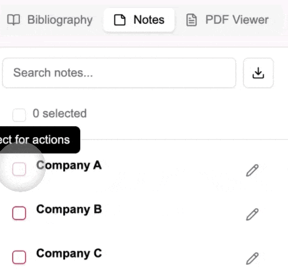
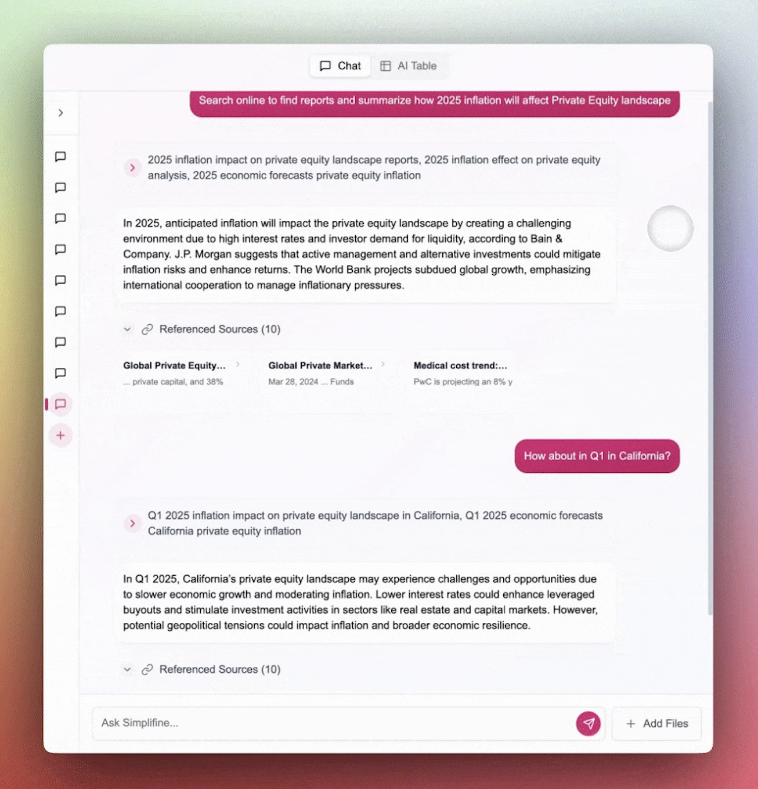

# **Project**

In the **Simplifine Interface - Workspace** guide, we introduced how to create a Project. Once inside a Project, the layout is designed to support all aspects of knowledge-building and research—from search and document management to data analysis. Below is an example of what an empty Project looks like:

> **Tip**: The Global Sidebar on the left remains accessible even within a Project.

## **Documents**&#x20;

Using the **Documents** section on the left, you can upload, access, retrieve, organize, and delete files needed within the project. You can switch between your **Bibliography**, **Notes**, and **PDF Viewer**.&#x20;

* **Bibliography** is connected to your **Library** and allows you to organize the files you upload.

* **Notes** is connected to your **Notebook** and allows you to organize the files you create.

Through both of these panels you can manage your files and documents.&#x20;

### How to search for my documents inside a Project?

To find for your Library items and Notes, you can use the search bar at the top of the Documents panel on the left.

### How to export my documents from a Project?

Exporting your documents is straightforward. Inside a Project, to export Library items or Notes:

1. Select the items you wish to export.

2. Click the "..." button above the item list.

3. Choose the export format you need:

   * **Bibliography** items can be exported as BibTeX.

   * **Notes** can be exported as PDF or Word documents.

## **Notepad**

In the center of the Project view, you'll find your **Notepad**, seamlessly connected to your Notebook. This tool allows you to create, edit, and organize insights, analyses, and reports directly within your project. All changes are saved back to your Notebook, ensuring consistency across projects.

The Notepad includes a variety of **formatting tools** to enhance your documentation:

1. **Text formatting options** such as headings, bullet points, numbered lists, and collapsible sections for better organization.

2. **Special tools** like code blocks, quotes, and image insertion to enrich your content.

The Notepad also features **AI-augmented tools** to boost productivity:

1. **Complete with AI**: Automatically complete sentences or sections using AI.

2. **Generate with AI**: Quickly create content, summaries, or analyses.

3. **AI-powered tables**: Structure and analyze data in tables efficiently.

You can also streamline your workflow using **command shortcuts**:

1. Use **@** to reference files or mention collaborators directly in your notes.

2. Use **/** to access the full toolkit, including both formatting tools and AI-augmented options.

These features and shortcuts make the Notepad a powerful workspace for capturing and enhancing your research insights.

## AI Chat

Our **AI Chat** leverages **agentic orchestration** to enhance your research experience. Your prompt is intelligently divided into subtasks, with the most suitable agents assigned based on performance optimization. The chat also supports **web search** and **data visualization**, enabling you to generate graphs or search the web seamlessly. Whenever the chat performs a web search, it provides **references** to ensure the information is credible and traceable.

You can also integrate files from your **Bibliography** into your chats. To do so, simply click on the **"Add File"** button next to the prompt input box. The chat retains memory of the files you include, making them easily accessible throughout your session for deeper analysis.

### Managing AI Chats

To create a new chat, click the "**(+)"** button on the AI Chat sidebar. If you do not have any previous chats, you can also use the "**New Chat**" button at the center of the AI Chat panel. By expanding the sidebar, you can rename or delete your chat tabs as needed.

### **AI Table**

To create an **AI Table**, start by selecting the Bibliography files you want to include using the **Documents** panel on the left. Then, click on the **"AI Table"** button that appears. Your AI Table will open in the right panel, where you can add **AI Prompts** or **Columns** to perform tasks like extraction, summarization, analysis, and categorization.

Don’t worry if your selection is not final! You can modify your AI Table even after it’s created by adding or removing files as needed. You can also refine your table by adding prompts through new columns, deleting rows or columns, and adjusting your data as your research evolves.

Additionally, you can **export your AI Table** as a **CSV** or **PDF**, making it easy to share and integrate your findings into other workflows.