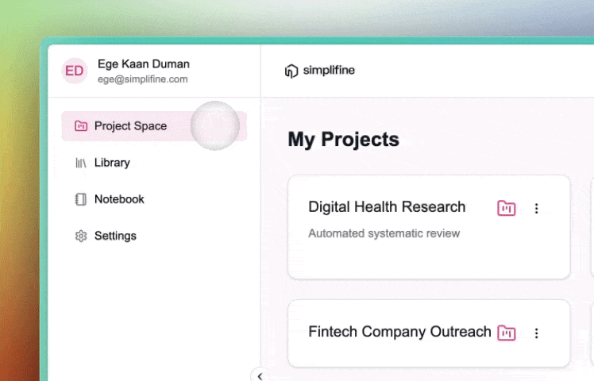
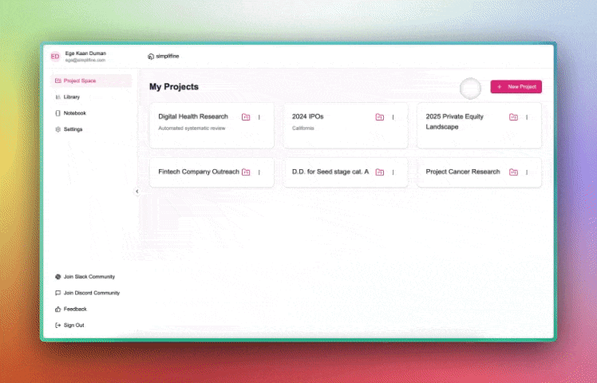
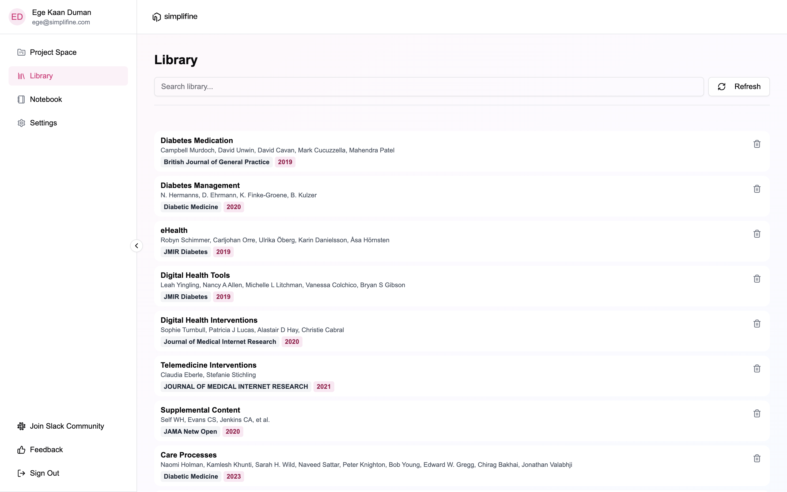
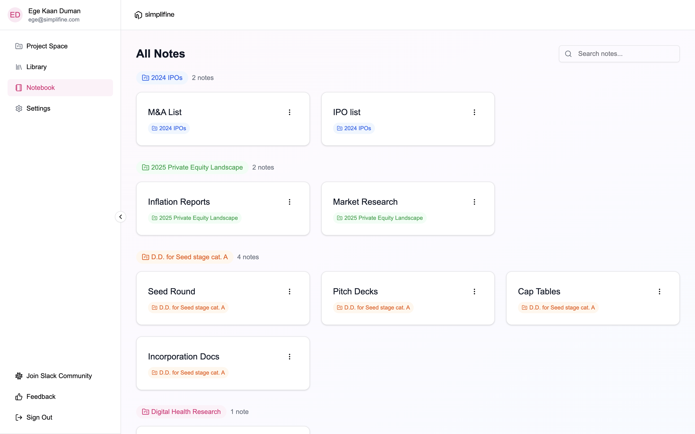
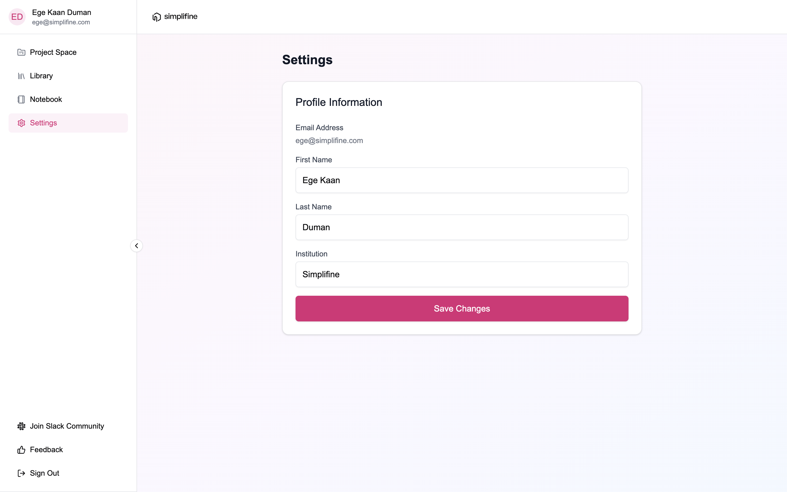

# **Simplifine Workspace**

The Simplifine interface is designed for smooth navigation, enabling you to manage files, collaborate with AI agents, and organize your notes efficiently. **Workspace** is the interface that you see first when you log in. It is composed of four primary tabs, accessible through **Sidebar.**

## **Sidebar**

**Sidebar** is your primary navigation hub, providing access to **Project Space**, **Library**, **Notebook**, and **Settings**. Use it to switch between sections effortlessly and maintain an organized workflow. Using the Sidebar, you can also join our community on [Discord](https://discord.com/invite/vvJ6A7MrMv) and [Slack](https://simplifineusers.slack.com/ssb/redirect), and quickly send just your feedback, bug reports, and feature requests using the "**Feedback**" button. We value our users and take all submissions very seriously.

## **Project Space**&#x20;

**Project Space** is where you manage your Projects, acting as dedicated workspaces where all files, notes, and resources for each research endeavor are housed. Here you can create, edit, delete, and open your Projects.

### How to Create a Project on Simplifine?

To create a Project for the first time, click on the circular "**(+)"** button at the center of the screen. Then name your Project and, optionally, add your Project details in the window that pops up.

To create a Project after your first one, click on "**Create Project**" button at the top right corner of Project Space. Then name your Project and, optionally, add your Project details in the window that pops up.

## **Library**&#x20;

Your documents are kept in your **Library**. Supporting various file types, including PDFs and CSVs in the Free Plan, the Library consolidates diverse data sources in one place. Here you can upload documents via file selection or drag-and-drop, tag files to categorize them for quick retrieval and analysis, delete files to streamline your workspace, organize files into folders, and add descriptions. To view and annotate your documents outside a Project, you can also use your Library and click on the file you want to open.

## Notebook

**Notebook** works like your **Library,** but instead of the files you upload or save on Simplifine, it is for the ones you create. So, Notebook view allows you to see all your Notes across all Projects. To view and edit your documents outside a Project, you can open your Notebook and can click on the file you want to access. &#x20;

## **Settings**&#x20;

Using the **Settings** page, you can update your account information.

